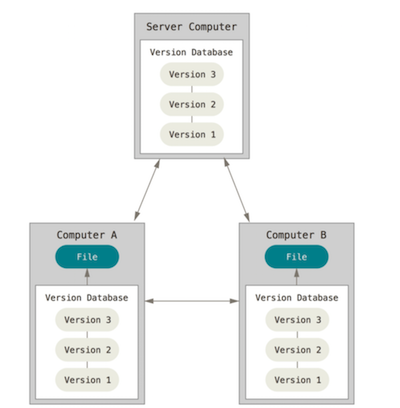
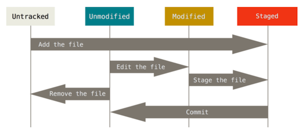

# Git Demo

Git is Distributed Version Control System.Version control is a system that records changes to a file or set of files over time so that you can recall specific versions later. For the examples in this book you will use so ware source code as the files being version controlled, though in reality you can do this with nearly any type of file on a computer.



**The workflow of Git**



Every files in a repository can only be in four status.

1. Untracked : Untracked files 


## Basic command of bash

```bash
cd some_directory#get into a directory
pwd #output the current directory
ls #list all the files/subdirectory in pwd
ls -al #list all the files/subdirectory in pwd(including hidden file)
mkdir directory_name #create a directory
rm some_file # Delete a file
rm -rf some_file_or_directory #Force to delete a file or directory
touch xxx.txt/xxx.md/xxx.py #Create a txt-based file
notepad xxx.txt/xxx.md/xxx.py #Use notepad to edit a txt-based file
```

## Make a Git Repository (Locally)

First, Open Git Bash in you desktop. Use pwd to show your working directory.  Get into the Desktop (cd).  Create (`mkdir`) a folder in your desktop. Get into the folder (cd). Use such command to create a repository.

```bash
git init
```

Use `(ls -al)`, you can find there exist a ".git" folder. It is the git store all the history of your repository.

## Configuration

```
git <verb> --help
git config --list
git config --global/local user.name "your name"
git config --global/local user.email "your email"
git config --global core.editor "notepad"
```

Of course, git can use locally.  However, to maximize its functionality, it is better to use it with github or other git server provider. Before your get into this step, you should create a github account and create a git repository first. 


## Manage a git repository

```
git add 
git commit -m "Some notes"
git commit
git status
git 
git push
git pull
git checkout
git branch

```

